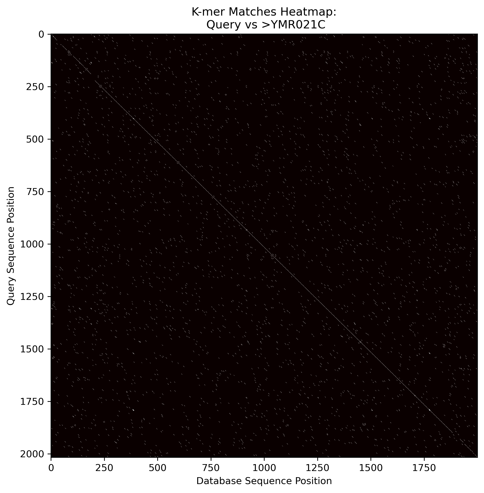

### Assignmet 1

Find nonmers in E.Coli genome

**Nonmers** are nucleotide sequences of length k that are not found in a given genome.
The goal of this assignment is to find nonmers in the genome of E.Coli

**Prerequisites:**
* The genome of the E.Coli in fasta format
* A function that takes the genome and returns a list of the nonmers


<u>Download the genome if not inside the given directory</u>


```python
working_dir = os.getcwd()
if not os.path.exists(f'{working_dir}/e_coli_genome.fa'):
	subprocess.run(f'wget -qO- https://ftp.ensemblgenomes.ebi.ac.uk/pub/bacteria/release-62/fasta/bacteria_26_collection/escherichia_coli_w_gca_000184185/dna/Escherichia_coli_w_gca_000184185.ASM18418v1_.dna.toplevel.fa.gz | gunzip > e_coli_genome.fa', shell = True)

path_to_genome = f'{working_dir}/e_coli_genome.fa'
```

<u>Define the function that computes the nonmers.</u>
```python
def nonmers(genomefile, k):
    #Example run
    # list_of_nonmers = nonmers(path_to_fasta_file, k = 5)
    
    import regex as re
    import itertools

    # Importing sequence
    file = open(genomefile, 'r')
    seq = "" #An empty string
    count = 0
    k =int(k)
    for line in file:
        count +=1
        if (count > 1) : #the first line of a fasta does not contain any part of the sequence
            length=len(line)
            seq=seq+line[0:length-1] #length-1 because the last character is the \n character
            
    file.close()

    seq = re.sub("[^AGCT]", "", seq) #Remove any non AGCT nucleotide from the sequence

    # Creating the kmer combination table
    nucleotides = ['A', 'C', 'G', 'T']
    allkmers = [''.join(p) for p in itertools.product(nucleotides, repeat=k)] #Create a list of all possible kmers

    kmer_genome_list = []
    for i in range(len(seq) - k + 1): #slide the whole genome with a step of 1 and append each kmer to the kmer_genome_list
        kmer_genome_list.append(seq[i:i+k]) 

    kmer_genome_set = set(kmer_genome_list) #Keep only the uniq kmers.
    return list(set(allkmers) - kmer_genome_set)
```
<br><br>


<u>Plot the number of nonmers over different values of k</u>
<br><br>


<div style="text-align: center;">
    
</div>

