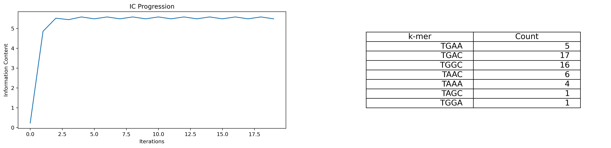

# Assignment 2

<u>**Goal**</u>
Find hidden motifs in a set of sequences using a Gibbs Sampling like approach.

<u>**Data**</u>
A multifasta file.

<u>**Approach**</u>
**1)** Randomly select a kmer from each sequence. From the chosen kmers form a PSSM matrix.
**2)** Scan the sequences using the PSSM and replace the motif from each sequence either with the highest scoring motif or with a motif chosen based on the probability of each motif. The probabilities are generated as mapping of score to probability.
**3)** Recompute the PSSM.
**4)** Repeat.

<u>**Implementation**</u>

<u>Load libraries</u>

```python
import os
from tqdm import tqdm
import matplotlib.pyplot as plt
```

<u>Define a function to load the sequences.</u>
```python
def load_sequences(path_to_sequences):
    seq_dic ={}
    seq = open(path_to_sequences, 'r')
    for i ,line in enumerate(seq):
        seq_dic['seq' + str(i)] = line.strip()
    return seq_dic
```

<u>Define a function to compute nucleotide frequencies.</u>
```python
#Write a function that calculates nucleotiude frequences
def nuccomp(sequence):
    #This function takes as input a sequence and outouts  numpy array of the frequence of each nucleaotide
    #The order of the output is A, T, G, C
    import numpy as np
    nucfreq = [0,0,0,0]
    nuc = ['A', 'T', 'G', 'C']
    for i in range(len(nuc)):
        nucfreq[i] = sequence.count(nuc[i])
    nucfreq = np.array(nucfreq)/len(sequence)
    return nucfreq
```

<u>Define a function to compute a PM matrix.</u>
```python
def pwm(sequences):
    # This function takes as input a list of equal length sequences and produces a pwm of size (4, 100)
    nuc = ['A', 'C', 'G', 'T']
    profile=[[0 for i in range(len(sequences[0]))] for j in range(len(nuc))]
    
    for instance in sequences:
        for j in range(len(instance)):
            residue=instance[j]
            profile[nuc.index(residue)][j]+=1
            profile[nuc.index(residue)][j]=float(profile[nuc.index(residue)][j])
    import numpy as np
    pwm = np.array(profile)
    pwm = pwm/len(sequences)
    return(pwm)
```

<u>Define a function to compute a PSSM matrix.</u>
```python
def pssm(pwm, nucfreqs):
    #This function takes as input a PWM as a numpy array of shape (4, 100) and a background nucleotide frequency array of shape (1, 4) and computres and returns a PSSM
    import numpy as np
    import math
    pseudocount=0.01
    pssm=[[0 for i in range(len(pwm[0]))] for j in range(len(nucfreqs))]
    for i in range(len(nucfreqs)):
        pssm[i]=(np.array(pwm[i])+pseudocount)/nucfreqs[i]
    for i in range(len(pssm)):
        for k in range(len(pssm[0])):
            pssm[i][k]=math.log(pssm[i][k])/math.log(2)
    return(np.array(pssm))
```

<u>Define a function that takes a sequence and a PSSM and scans the sequence with the given PSSM.</u>
```python
def pssmSearch(pssm, sequence, threshold):
    #This function takes as input a pssm computed form a set of small sequences
    # A longer target sequence i want to scan 
    # A matching threshold
    
	#The function returns a dictionary where keys are kmers and values the index of the kmer in the target sequence and the matching score
    nuc = ['A', 'T', 'G', 'C']
    hits = []
    instances = []
    x = [] #A list that holds indexes for the second step
    allscores = [] #for plotting reasons

    # Step 1: Calculation of the maximum possible pssm score
    maxPssm = 0
    #Compute the maximum PSSM value. This is the sum of the max of each column in the PSSM matrix
    for j in range(len(pssm[0])): #This essentially gives me the lenth of each sequence.
        maxPssm = maxPssm + max(pssm[:,j]) 
        #This means add to max the maximum value of the jth column pssm[:,j] is the jth column of the pssm array
        #Note that although I am computing probability I am using the sum of the pssm values and not their product.
        #This is because at the last step of the pssm function I log transformed the frequences


    # Step 2: Search 
    kmer_dictionary = {}
    for i in range(len(sequence) - len(pssm[0])):
        x.append(i)
        instance = sequence[i:i+len(pssm[0])] #This is a kmer
        # print(instance)
        score = 0
        for l in range(len(instance)):
            score = score + pssm[nuc.index(instance[l])][l]
        kmer_dictionary[instance] = (i,score.item())
    return kmer_dictionary
```

<u>Load libraries</u>
```python
def information_content(pwm):
    import math
    I_list = []
    for pos in pwm.T.tolist():
        I = 0
        for nuc in pos:
        #If statement is used because log(0) returns error
            if nuc != 0:
                #print(nuc)
                info = nuc*math.log2(nuc)
                I = I + info
                    #print(info)
        I_list.append(2+I)

    return sum(I_list)
```

<u>Implement the iterative sampler.</u>
```python
path_to_sequnces = f'{os.getcwd()}/motifs_in_sequence.fa'
seq_dic = load_sequences(path_to_sequnces)

k = 4
number_of_iterations =20
num_of_seq = len(seq_dic)
length_of_seq = len(seq_dic['seq0'])
```

<u>Load libraries</u>
```python
ic = []

# Step 1: Initialization
# ##Create a dictionary that randomly chooses indexes for kmers in each sequene
import random
random_indeces_dix = {key : random.randint(0, (length_of_seq - k) + 1) for key in seq_dic.keys()}
print(random_indeces_dix)
#random_indexes_dix

#Crate a list of random kmers
initial_kmers_dic = {}
initial_kmers_dic = {key: seq[random_indeces_dix[key]:random_indeces_dix[key] + k] for key,seq in seq_dic.items()}
list_for_update = [initial_kmers_dic[key] for key in seq_dic.keys()]


for _ in range(number_of_iterations):
    current_pwm = pwm(list_for_update)
    current_pssm = pssm(nucfreqs=nuccomp(''.join(list_for_update)), pwm = current_pwm)
    ic.append(information_content(current_pwm))
    for y, seq in enumerate(seq_dic.values()):

        scan = pssmSearch(pssm=current_pssm, sequence=seq, threshold=0)
        best_kmer = max(scan, key=lambda k: scan[k][1])
        list_for_update[y] = best_kmer
        
        
                
kmer_dictionary = dict(zip(list_for_update, len(list_for_update) * [0]))
for kmer in list_for_update:
    kmer_dictionary[kmer] +=1

```


<u>Plot hte information content over iterations.</u>
<br><br>


<div style="text-align: center;">
    
</div>